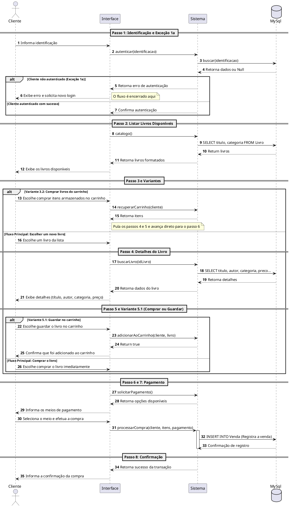
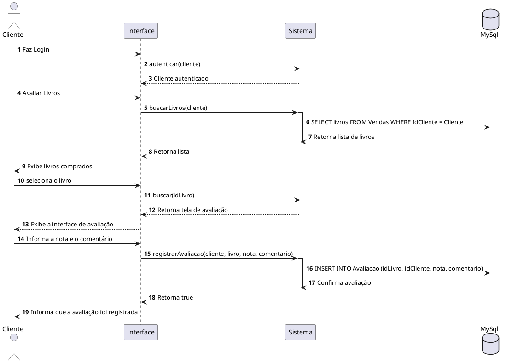
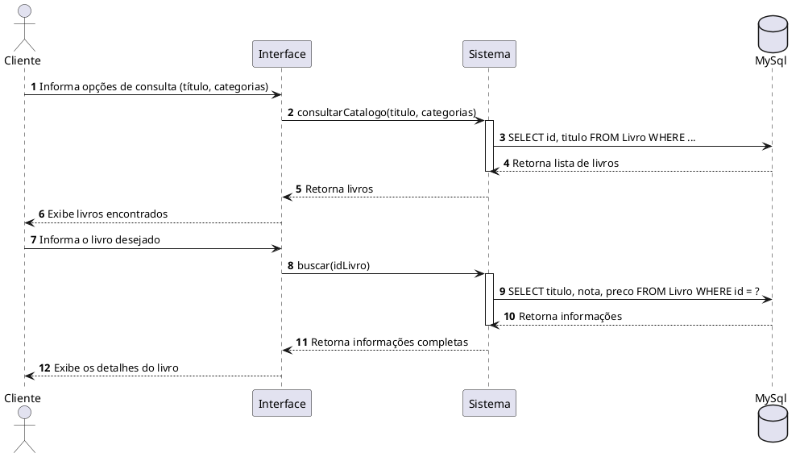
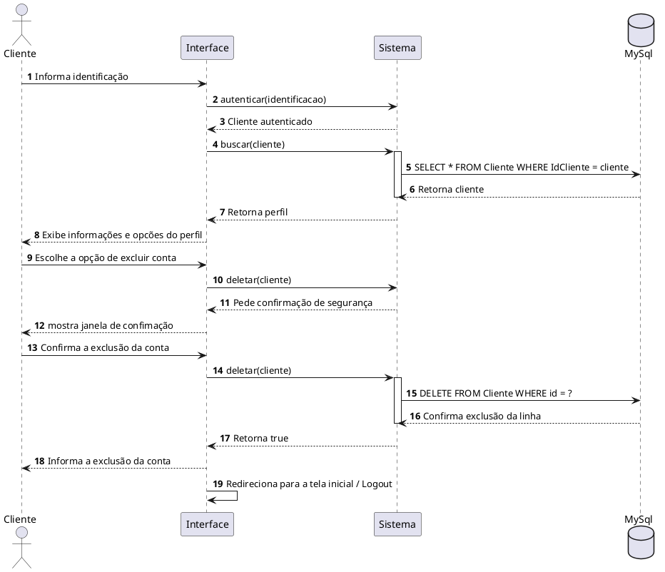
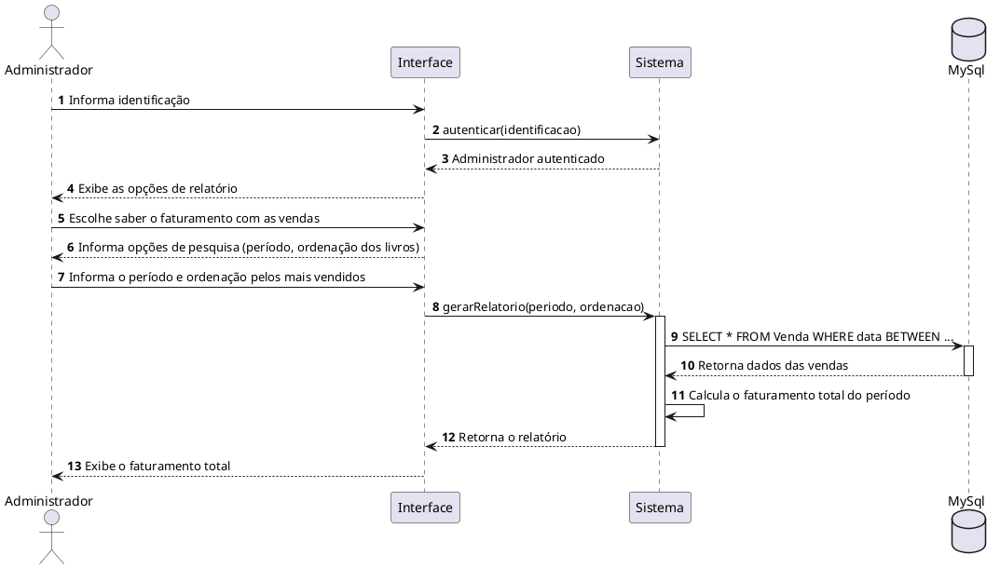
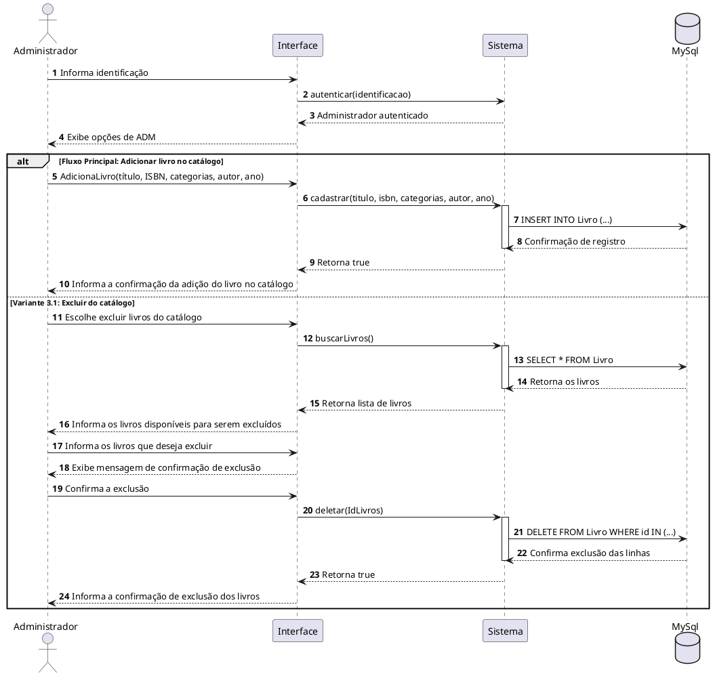
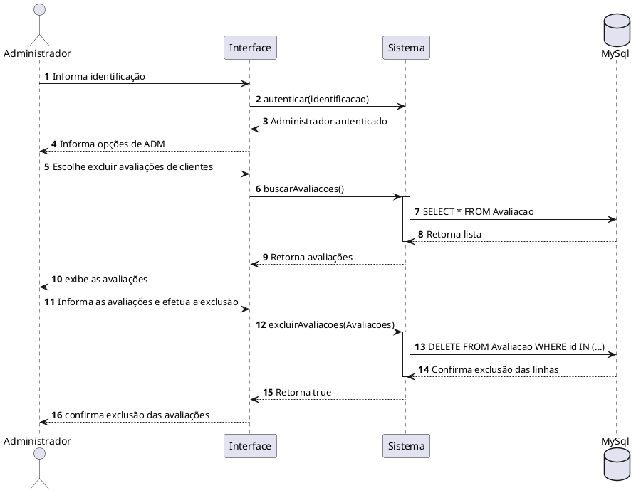
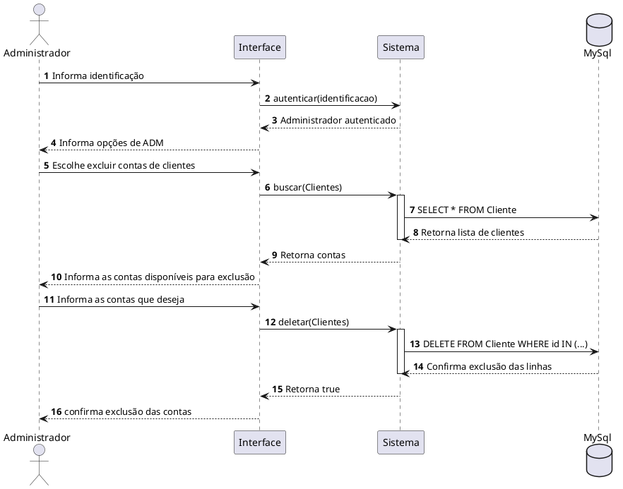

## Documento de visualização dos scripts usados no PlantUML

Este documento apresenta a modelagem visual e arquitetural dos processos do sistema. Utilizando a plataforma web **PlantUML**, foram desenvolvidos os seguintes scripts para a criação de diagramas. 

Abaixo encontra-se os códigos-fonte em formato texto que representam cada caso de uso. Estes scripts podem ser copiados e executados diretamente em qualquer renderizador online do PlantUML para gerar, visualizar ou editar as imagens dos fluxos de interação documentados.

---

### UC1 - Registrar Venda

### UC2: Manter Avaliações

### UC3: Consultar Catálogo

### UC4: Manter Conta

### UC5: Exibir Relatório de Faturamento

### UC6: Gerenciar Catálogo 

### UC7: Gerenciar Avaliações

UC8: Gerenciar Contas de Clientes

